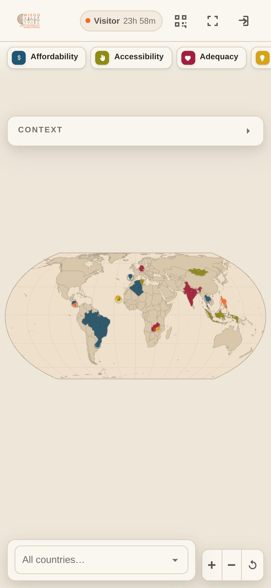
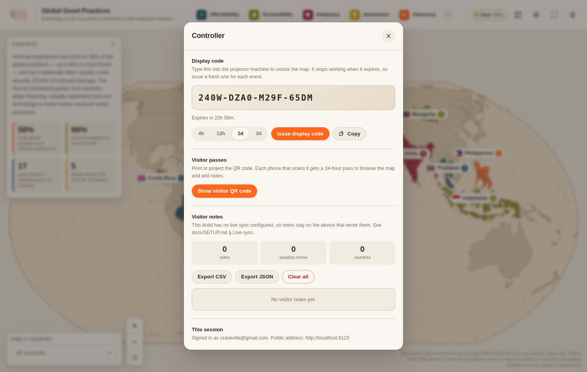

# Global Good Practices — Interactive Booth Map

An interactive 3D world map for a conference booth, built to teach visitors how
countries are extending social insurance to informal and self-employed workers.
Fifty good practices across forty countries, organised by the **Five As**
framework.

Built as a static site: no server, no build step, no framework. Publish the
repository to GitHub Pages and it runs.


---

## What it does

**A real map, not a picture of one.** Country borders come from Natural Earth
1:50m — the same admin-0 dataset behind most published world maps — triangulated
and extruded into WebGL geometry with Three.js. Every one of the 241 features is
individually pickable. The projection is Equal Earth, so no country is inflated
relative to another.

**The forty countries with a practice stand up out of the map**, coloured by
their Five As category, named with a flag and a count. Everything else stays
low and quiet in WIEGO's khaki.

**Nothing is spelled out until you ask.** Clicking a country opens its panel;
clicking a practice inside it opens the detail. That is the booth interaction —
a visitor points at a country, you click it, and the story appears.

**Find any country, however small.** Cabo Verde is four pixels wide at world
zoom. The searchable picker lists all 236 named countries with their flags, with
practice countries grouped at the top, so nothing depends on hitting a tiny
target. Zoom with the wheel, pinch, the `+`/`−` buttons or a double-click.

**Three roles, one URL.**

| Role | How they get in | What they can do |
|---|---|---|
| **Host** | Google sign-in, matched against a hashed address | Issue codes, moderate notes, export |
| **Display** | Types a 16-character code | Full-screen presentation |
| **Visitor** | Scans the QR code | Browse on their phone, add notes for 24 hours |

**Visitors write on the map.** A phone that scans the booth QR gets a
time-limited pass, picks any country, and adds what they know. Their notes show
up on the country's panel and as a count on its label.

| | |
|---|---|
|  |  |
| A visitor's phone | The host's controller panel |

---

## Quick start

```bash
npm start        # http://localhost:8080
```

Then, in the page:

1. **Event host** tab → sign in (see [docs/SETUP.md](docs/SETUP.md) to configure
   Google sign-in or an owner passphrase)
2. **Controller → Issue display code** — that is what the projector machine types
3. **Controller → Show visitor QR code** — that is what goes on the stand

Before your first real event, read [docs/SETUP.md](docs/SETUP.md). At minimum,
rotate the event secret:

```bash
npm run secret
```

---

## Layout

```
index.html            App shell and the access gate
config.js             Everything an event host edits — start here
css/style.css         WIEGO palette, Lato, responsive down to a phone

js/
  main.js             Bootstrap and wiring
  map3d.js            Three.js scene: extrusion, picking, camera, pins
  geo.js              Equal Earth projection and TopoJSON decoding
  labels.js           DOM country labels, placement and collision
  ui.js               Legend, picker, country panel, sheets
  practices.js        The Five As framework, context and lookups
  practices-data.js   GENERATED from the spreadsheet — do not hand-edit
  auth.js             Roles, Google ID token verification
  tokens.js           Self-verifying display codes and visitor passes
  store.js            Visitor notes: local, or Firestore when configured
  qr.js               QR rendering
  config-loader.js    Config defaults

data/
  countries-50m.json  Natural Earth 1:50m admin-0 (world-atlas)
  world-index.json    Generated: ISO codes, names, bboxes, label anchors
  source/
    good-practices.csv  The content of record — edit here, then npm run import

tools/
  build-index.mjs     Regenerates world-index.json
  import-practices.mjs  CSV -> js/practices-data.js
  check.mjs           End-to-end browser test
  serve.mjs           Local static server
  secret.mjs          Prints a new event secret
  passphrase.mjs      Hashes an owner passphrase
  ownerhash.mjs       Hashes the host's email so it stays out of the source

vendor/               three.js, earcut, qrcode-generator — all committed
assets/flags/         270 SVG flags (flag-icons)
```

Everything third-party is committed rather than fetched from a CDN. A booth on
bad conference wifi should not depend on unpkg being up.

---

## Testing

```bash
npm i -g playwright   # once
npm run check         # 87 assertions in a real browser
SHOTS=1 npm run check # also writes screenshots to .shots/
```

The check drives a real Chromium: it mints a code with the same scheme the app
uses, unlocks the gate, waits for the WebGL scene, then exercises the picker,
the country panel, hovering and clicking countries directly in the 3D scene, the
Five As filter, the QR sheet, the full guest flow and the controller flow — at
booth resolution, on a phone viewport, and as the host — including the
passphrase fallback, and a pass over the shipped `config.js` asserting the event
is actually configured rather than still on the defaults.

It also asserts the things that would embarrass you at a booth: that a wrong,
expired or foreign-secret code is refused; that a note containing markup is
escaped rather than executed; that all five categories fit a 1600px screen with
five distinct colours; that the phone layout never scrolls sideways; and that a
button icon stays icon-sized.

---

## Updating the content

The practices come from WIEGO's own database, not from anything written here.
`data/source/good-practices.csv` is the file of record — a CSV rather than the
original `.xlsx` so that a content change shows up as a reviewable diff instead
of an opaque binary blob.

To update after a new export:

```bash
# Export the "Good Practices (5As)" sheet as CSV over the existing file, then:
npm run import
npm run check
```

The importer places and classifies; it never rewrites. Scheme names,
descriptions, impacts and sources are copied verbatim, and any row it cannot
resolve — an unknown 5A category, a country not on the map, a missing scheme
name — is a hard error that writes nothing, rather than a silent drop that would
leave a country quietly unlit at the booth.

Columns it expects: `category`, `country`, `agency`, `scheme`, `description`,
`impact`, `sources`.

## Map notes

Natural Earth carries five polygons with no ISO code — Somaliland, Kosovo,
Northern Cyprus, the Indian Ocean Territories and the Siachen Glacier. They are
drawn as neutral land: no label, no flag, not in the country picker, so the map
makes no claim either way. The standard disclaimer sits in the page footer.

---

## Licences

| | |
|---|---|
| Three.js | MIT |
| earcut | ISC |
| qrcode-generator | MIT |
| world-atlas / Natural Earth | Public domain |
| flag-icons | MIT |
| WIEGO logo and palette | © WIEGO — used under the 2019 Brandbook |
