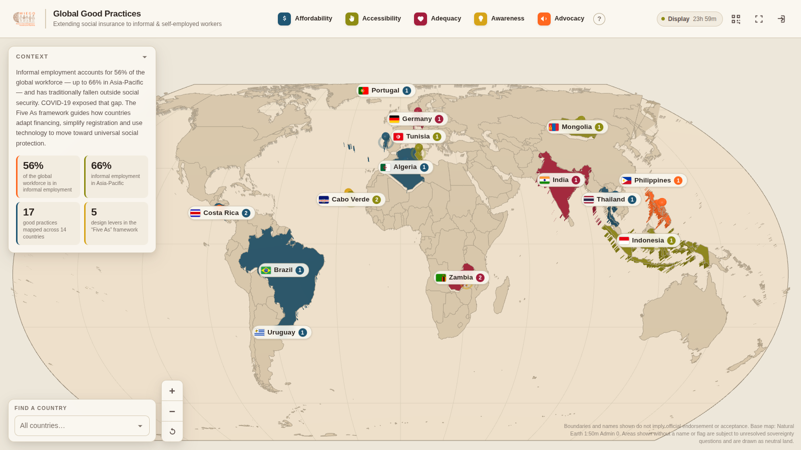
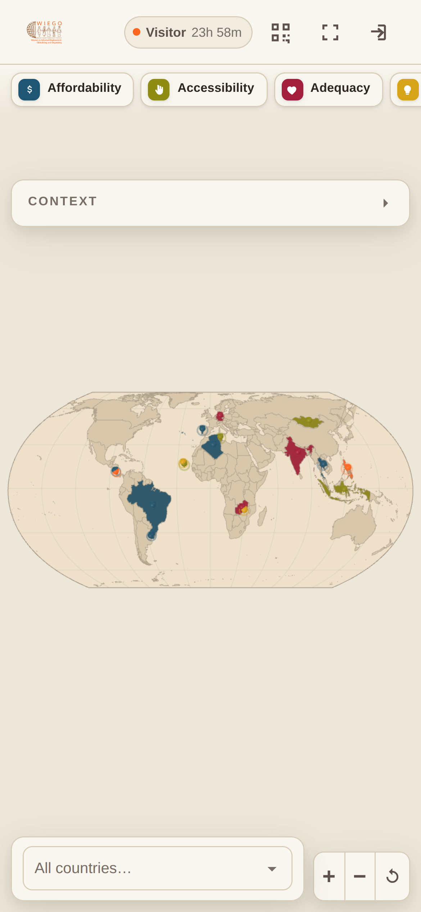
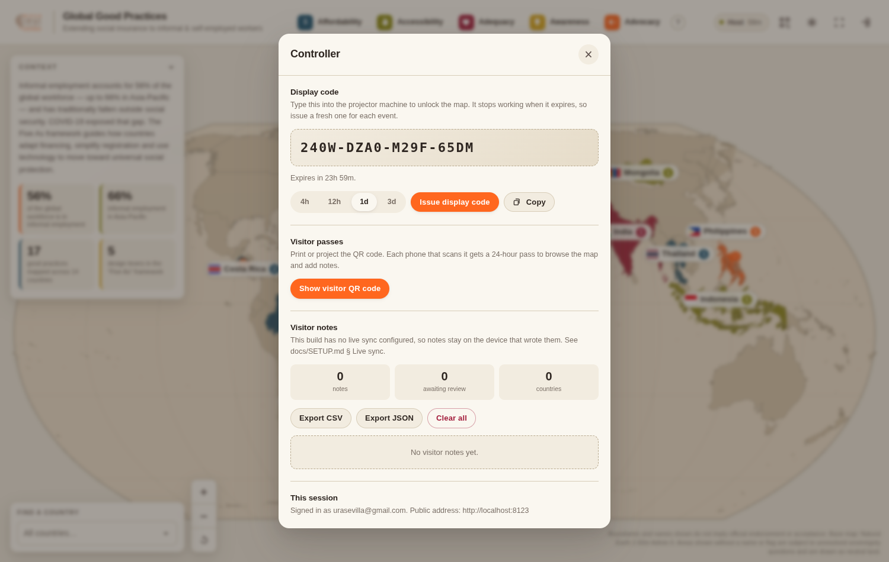

# Global Good Practices — Interactive Booth Map

An interactive 3D world map for a conference booth, built to teach visitors how
countries are extending social insurance to informal and self-employed workers.
Fifty good practices across forty countries, organised by the **Five As**
framework.

Built as a static site: no server, no build step, no framework. Publish the
repository to GitHub Pages and it runs.



---

## What it does

**A real map, not a picture of one.** Land comes from Natural Earth 1:50m — the
same admin-0 dataset behind most published world maps — triangulated into WebGL
geometry with Three.js. Of its 241 features the map draws 240, and every
country among them is individually pickable. The projection is Equal Earth, so
no country is inflated relative to another.

**It draws no boundaries.** Land is one surface in one colour, flat on the ocean
plane: no border layer, no selection outline, no per-country tint, no extrusion.
Each of those existed once and each of them drew frontiers — the walls of an
extruded solid are mostly its borders, and so was the ring that used to appear
around a hovered country. WIEGO's disclaimer sits under the map, and the map is
built so it can make it.

**Every country is a marker.** The countries with a practice stand a pin in
their Five As colour, named with a flag and a count; the rest get a plain dot in
the land's own ink. The land says nothing now, so the marker is what says "this
is a country, and you can open it" — and hovering or selecting shows on the
marker and the name chip, never on the land.

**Nothing is spelled out until you ask.** Clicking a country — its marker or
its land — opens its panel; clicking a practice inside it opens the detail. That
is the booth interaction: a visitor points at a country, you click it, and the
story appears.

**Find any country, however small.** Cabo Verde is four pixels wide at world
zoom. The searchable picker lists all 235 named countries with their flags, with
practice countries grouped at the top, so nothing depends on hitting a tiny
target. Zoom with the wheel, pinch, the `+`/`−` buttons or a double-click.

**Three roles, one URL.**

| Role | How they get in | What they can do |
|---|---|---|
| **Host** | Google sign-in, matched against a hashed address | Issue codes, moderate notes, export |
| **Display** | Types a 16-character code | Full-screen presentation |
| **Visitor** | Scans the QR code | Browse on their phone, add notes — no time limit |

**Visitors write on the map.** A phone that scans the booth QR gets a pass,
picks any country — mapped practice or not — and adds what they know. The pass
does not expire (`guestPassHours: 0`); set a number of hours there if you want
one that does. Either way, `npm run secret` retires every outstanding pass at
once, which is how a pass with no expiry is taken back.

**Nothing a visitor writes reaches the map unreviewed.** With
`moderateContributions` on, a new note is stored but shown to nobody except its
author; the host's screen raises an approval prompt naming the country and
quoting the note, and only *Approve & post* puts it on the country's panel and
into the count on its label. *Reject* discards it. *Later* returns it to the
queue in the controller panel. Set `moderateContributions: false` in
`config.js` for an unmoderated room.

| | |
|---|---|
|  |  |
| A visitor's phone | The host's controller panel |

---

## Quick start

```bash
npm start        # http://localhost:8080
```

Then, in the page:

1. **Event host** tab → sign in (see [docs/SETUP.md](docs/SETUP.md) to configure
   Google sign-in or an owner passphrase)
2. **Controller → Issue display code** — that is what the projector machine types
3. **Controller → Show visitor QR code** — that is what goes on the stand

Before your first real event, read [docs/SETUP.md](docs/SETUP.md). At minimum,
rotate the event secret:

```bash
npm run secret
```

---

## Layout

```
index.html            App shell and the access gate
config.js             Everything an event host edits — start here
css/style.css         WIEGO palette, Lato, responsive down to a phone

js/
  main.js             Bootstrap and wiring
  map3d.js            Three.js scene: land, markers, picking, camera
  geo.js              Equal Earth projection and TopoJSON decoding
  labels.js           DOM country labels, placement and collision
  ui.js               Legend, picker, country panel, sheets
  practices.js        The Five As framework, context and lookups
  practices-data.js   GENERATED from the spreadsheet — do not hand-edit
  auth.js             Roles, Google ID token verification
  tokens.js           Self-verifying display codes and visitor passes
  store.js            Visitor notes: local, or Firestore when configured
  qr.js               QR rendering
  config-loader.js    Config defaults

data/
  countries-50m.json  Natural Earth 1:50m admin-0 (world-atlas)
  world-index.json    Generated: ISO codes, names, bboxes, label anchors
  source/
    good-practices.csv  The content of record — edit here, then npm run import

tools/
  build-index.mjs     Regenerates world-index.json
  import-practices.mjs  CSV -> js/practices-data.js
  check.mjs           End-to-end browser test
  serve.mjs           Local static server
  secret.mjs          Prints a new event secret
  passphrase.mjs      Hashes an owner passphrase
  ownerhash.mjs       Hashes the host's email so it stays out of the source

vendor/               three.js, earcut, qrcode-generator — all committed
assets/flags/         270 SVG flags (flag-icons)
```

Everything third-party is committed rather than fetched from a CDN. A booth on
bad conference wifi should not depend on unpkg being up.

---

## Testing

```bash
npm i -g playwright   # once
npm run check         # 87 assertions in a real browser
SHOTS=1 npm run check # also writes screenshots to .shots/
```

The check drives a real Chromium: it mints a code with the same scheme the app
uses, unlocks the gate, waits for the WebGL scene, then exercises the picker,
the country panel, hovering and clicking countries directly in the 3D scene, the
Five As filter, the QR sheet, the full guest flow and the controller flow — at
booth resolution, on a phone viewport, and as the host — including the
passphrase fallback, and a pass over the shipped `config.js` asserting the event
is actually configured rather than still on the defaults.

It also asserts the things that would embarrass you at a booth: that a wrong,
expired or foreign-secret code is refused; that a note containing markup is
escaped rather than executed; that all five categories fit a 1600px screen with
five distinct colours; that the phone layout never scrolls sideways; and that a
button icon stays icon-sized.

---

## Updating the content

The practices come from WIEGO's own database, not from anything written here.
`data/source/good-practices.csv` is the file of record — a CSV rather than the
original `.xlsx` so that a content change shows up as a reviewable diff instead
of an opaque binary blob.

To update after a new export:

```bash
# Export the "Good Practices (5As)" sheet as CSV over the existing file, then:
npm run import
npm run check
```

The importer places and classifies; it never rewrites. Scheme names,
descriptions, impacts and sources are copied verbatim, and any row it cannot
resolve — an unknown 5A category, an unknown worker group, a country not on the
map, a missing scheme name — is a hard error that writes nothing, rather than a
silent drop that would leave a country quietly unlit at the booth.

Columns it expects: `category`, `workers`, `country`, `agency`, `scheme`,
`description`, `impact`, `sources`.

`workers` drives the worker-group filter, and its permitted values are the
labels in `WORKER_IDS` (`tools/import-practices.mjs`), kept in step with
`WORKER_GROUPS` in `js/practices.js`. Adding a group means adding it to both —
the importer refuses a row naming a group it does not know, so a whole class of
workers cannot go missing from the filter unnoticed.

## Hosting

The repository is the site: no build step, no bundler, no output directory.
Every asset path is relative and there is no `<base>` tag, so the same commit
serves correctly from a root domain and from a subpath. GitHub Pages publishes
it at `/interactivemap/` via `.github/workflows/pages.yml`; Netlify publishes it
at a domain root via `netlify.toml`. Neither needs a flag, a rewrite, or a
different build.

`npm run check` holds that invariant: it mounts the site under a path prefix,
fails on any request that 404s, and rejects a root-absolute reference or a
hardcoded origin in the source. See `docs/SETUP.md` § 1 for the setup of each,
including the one thing a move does break — the Google OAuth origin list.

## Map notes

**Two lenses, one map.** The Five As filter (what barrier a practice
addresses) and the worker-group filter (who it is for) compose rather than
replace each other: a country stays lit only if it has a practice answering
both. The context card follows — unfiltered it carries the framing, all five
barriers and the headline numbers; under a lens it narrows to that one barrier
and what is currently on the map.

**The camera is orthographic.** A perspective camera looking at a tilted plane
foreshortens the far edge far harder than the near one, which across a whole
world map reads as the projection itself being wrong — a northern hemisphere
crushed into a band while South America stretches. A parallel projection
foreshortens every part of the map by the same `cos(tilt)`, so Equal Earth
arrives on screen as Equal Earth and the markers keep one depth from edge to
edge. `tools/check.mjs` asserts it by measuring 60°N and 60°S against the
equator, at the home view and zoomed out.

**Land is drawn once, merged.** Two coplanar meshes meeting along a shared arc
can still show a hairline where they join, and a hairline along every frontier
is the border layer back again — so every land polygon goes into one mesh with
one material. The per-country meshes are still built, and still carry the keys
the raycaster reads, but they are never drawn: they are what makes hovering name
a country and tapping open one.

**A phone opens part-way in.** Fitting the whole projection to a 390px screen
gives each country about four pixels, so a narrow viewport opens over the belt
carrying most of the mapped practices and pinches out from there. Taps carry a
few pixels of forgiveness, because a fingertip is wider than Singapore.

**Label anchors are computed unwrapped.** A country whose outline crosses the
antimeridian averages to a centroid nowhere near its land — Russia's came out
in the Bering Sea, which failed the interior test and fell through to a grid
search that parked "Russia" on St Petersburg; Fiji's landed in the Atlantic.
`tools/build-index.mjs` accumulates a ±360° offset across each jump so the ring
is one continuous run before any of it is measured.

Natural Earth carries five polygons with no ISO code — Somaliland, Kosovo,
Northern Cyprus, the Indian Ocean Territories and the Siachen Glacier. They are
land here and nothing else: no marker, no label, no flag, not in the picker, and
nothing to select, because every answer the map could give about them would be
taking a side. Their polygons stay in the merged land layer all the same —
leaving them out would carve a hole, which marks the place out as plainly as
naming it would. Nothing names a sea, a gulf or a strait either; the only text
over the map is a country chip, each anchored over its own land.

---

## Licences

| | |
|---|---|
| Three.js | MIT |
| earcut | ISC |
| qrcode-generator | MIT |
| world-atlas / Natural Earth | Public domain |
| flag-icons | MIT |
| WIEGO logo and palette | © WIEGO — used under the 2019 Brandbook |
